## 项目介绍

一个为高校内部教职工精心设计的 **商品购物服务网站**。用户可以以任意 **姿态（未登录 / 已登录）** 在该网站中浏览其中提供的精美商品，浏览之余也可以将心仪的商品加入购物车，完成支付后能够在个人中心查看所有订单的详情信息

仍然感到困惑？那么赶紧点击 👉 [这里](https://shop.asnpro.icu) 在线体验一下吧！

## 项目设计

基于 SPA 的网页设计思想，本项目抽象出了 2 套公共布局（Layout）以保持整个项目的统一性和可扩展性

公共布局 1：

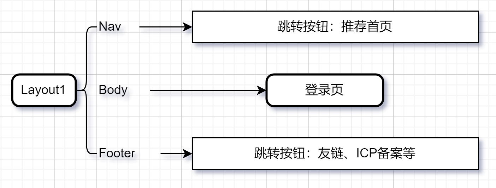

公共布局 2：

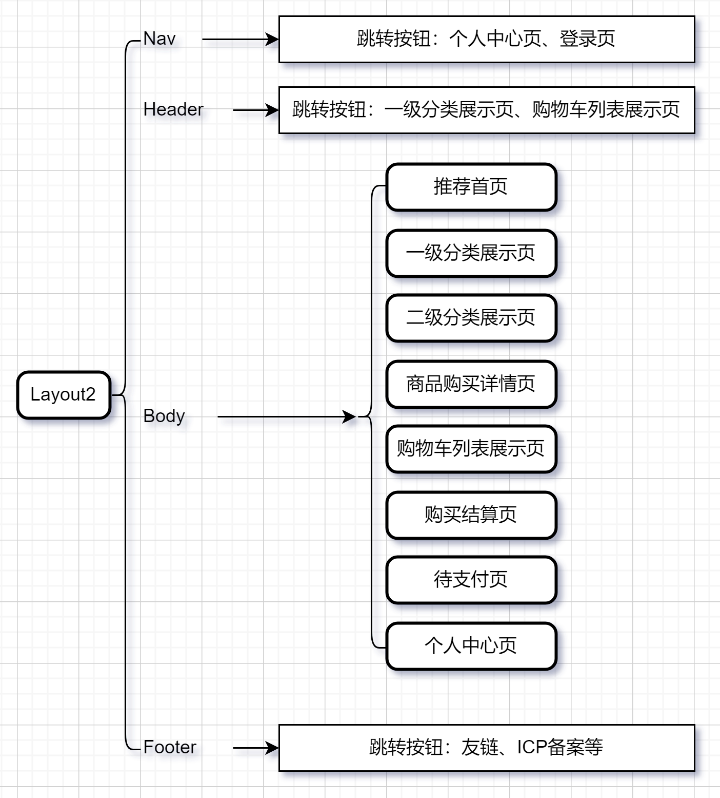

## 技术选型

- [Vue 3](https://vuejs.org/) 
- [Vue-Router](https://router.vuejs.org/) 
- [Pinia](https://pinia.vuejs.org/) 
- [Element-Plus](https://element-plus.org/zh-CN/) 
- [Vite](https://vitejs.dev/) 

## 项目展示

1. 登录页：

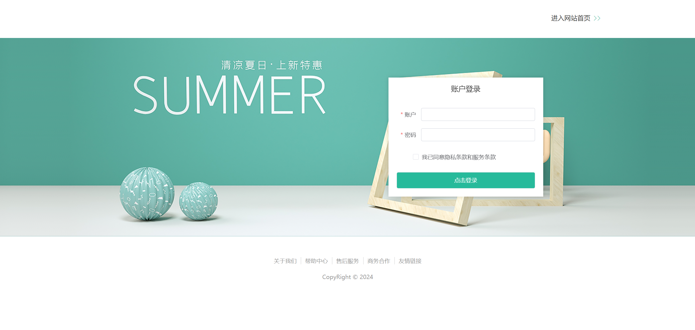

2. 推荐首页：

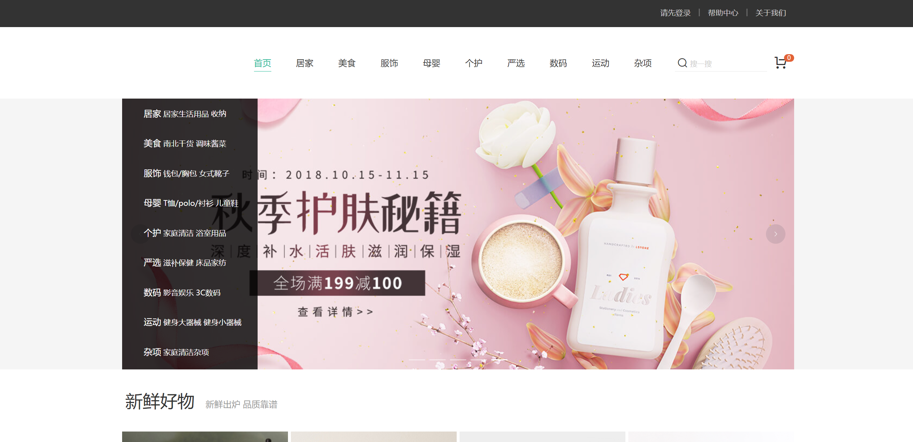

3. 一级分类展示页：

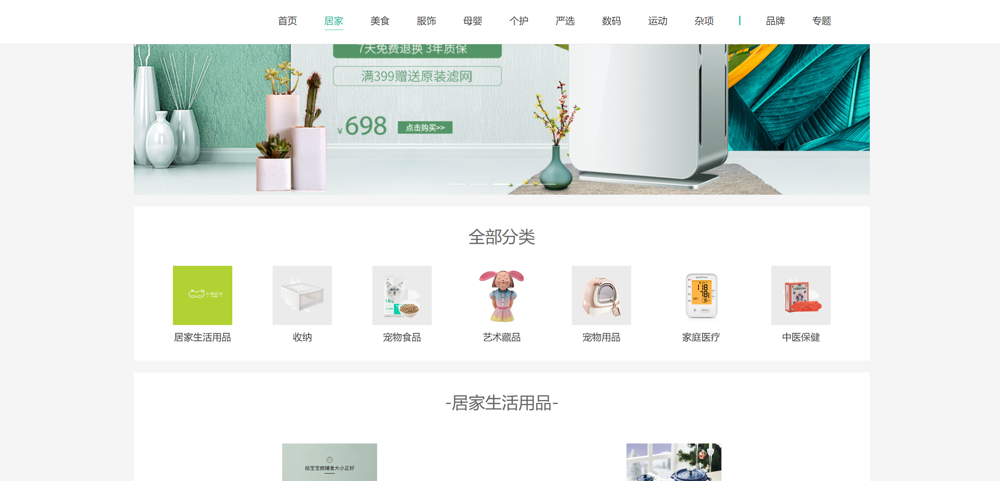

4. 二级分类展示页：

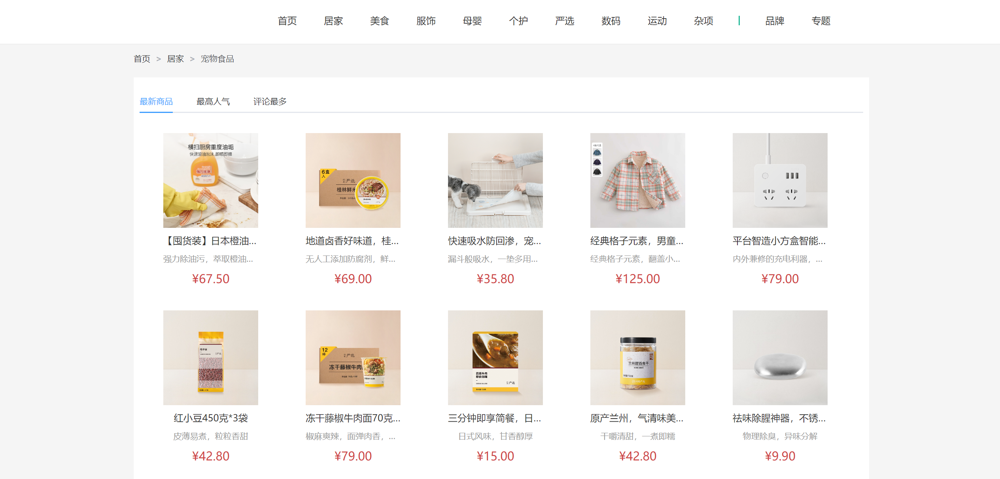

5. 商品购买详情页：

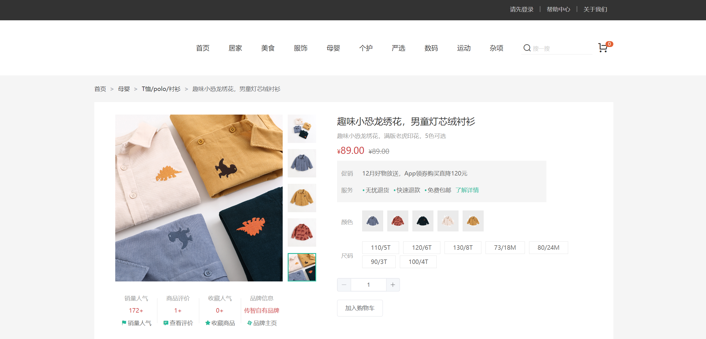

6. 购物车列表展示页：

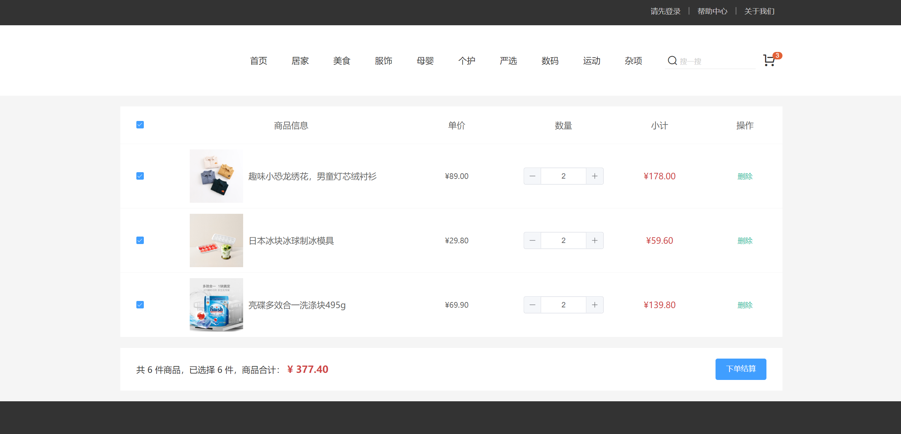

7. 购买结算页：

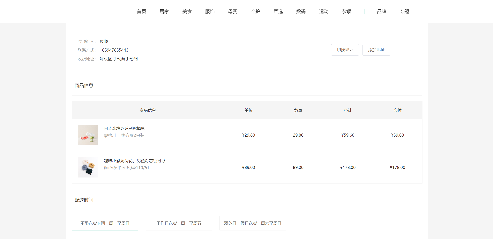

8. 待支付页：

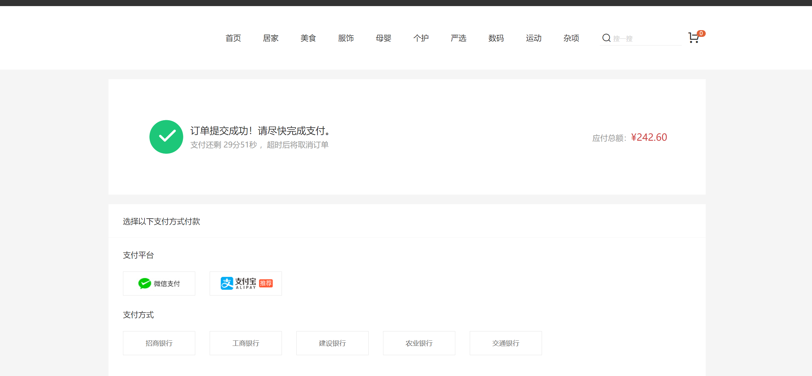

9. 个人中心页：

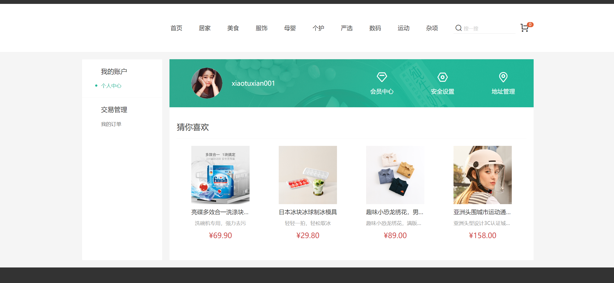

## 依赖安装

本项目使用 npm 作为包管理工具，如果你对该项目感兴趣，在将源代码克隆到本地后，可以使用如下指令安装依赖：

```bash
npm install
```

然后，你可以使用如下指令启动项目：

```bash
npm run dev
```

打包项目的指令为：

```bash
npm run build
```

